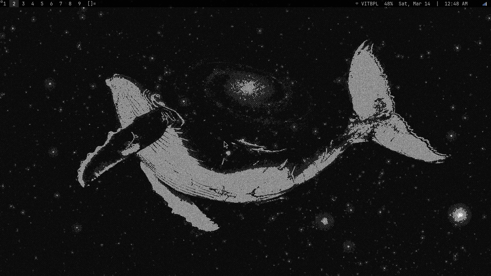
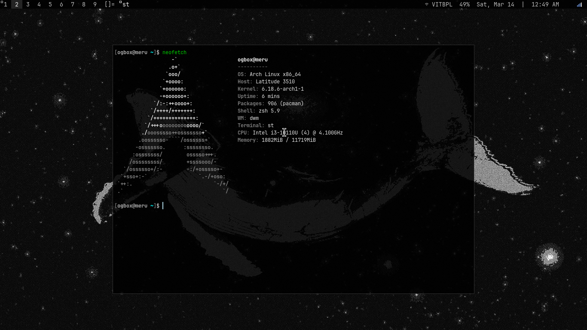
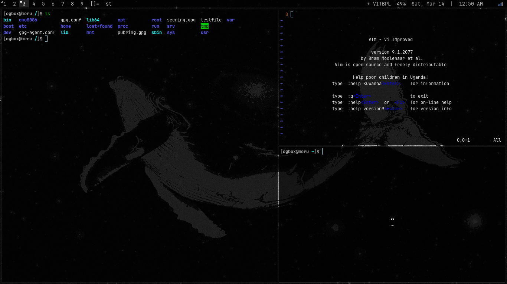

# dotfiles

my personal arch linux setup. minimal, fast, keyboard driven.





---

## system

| | |
|---|---|
| os | arch linux |
| wm | dwm 6.6 |
| terminal | st |
| shell | zsh |
| bar | dwmblocks |
| compositor | picom |
| launcher | dmenu |
| font | JetBrainsMono Nerd Font |
| wallpaper | whale in space |

---

## dwm patches

vanitygaps — pertag — scratchpad — movestack — selfrestart — bar_alpha — bar_systray — bar_indicators — attachx

## st patches

alpha — alpha_focus_highlight — anysize — boxdraw — copyurl — ligatures — scrollback — scrollback_mouse — undercurl

---

## keybinds

see [keybinds.txt](keybinds.txt) for the full reference.

quick overview:

| key | action |
|---|---|
| super + return | terminal |
| super + d | dmenu |
| super + shift + v | clipboard history |
| super + j/k | focus window |
| super + h/l | resize master |
| super + 1-9 | switch tag |
| super + ` | scratchpad |
| print | screenshot |
| super + print | selection screenshot |

---

## install

this uses a bare git repo to track dotfiles without symlinks.

```bash
git clone --bare git@github.com:ogbox/dotfiles.git $HOME/.dotfiles
alias dot='git --git-dir=$HOME/.dotfiles/ --work-tree=$HOME'
dot checkout
dot config status.showUntrackedFiles no
```

you'll also need:
```bash
sudo pacman -S dwm st dmenu picom dunst sxhkd dwmblocks \
               pamixer xbacklight maim xclip clipmenu \
               feh nm-applet blueman slock zsh
```

build dwm and st from source after checking out.
